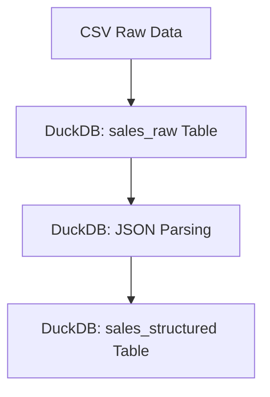

# How to make data structured using DuckDB

This project demonstrates how to load, parse, and store raw and structured sales data into a DuckDB database (`sales.duckdb`). The raw data contains JSON columns that are parsed and transformed into a structured format. The following steps outline the process:

1. **Load raw CSV data** into DuckDB (`sales_raw` table).
2. **Parse JSON columns** (`product_info`, `store_info`) into structured fields.
3. **Store structured data** in the `sales_structured` table for easy querying.

## Files

- `sales_data_with_json.csv`: The raw sales data with JSON fields.
- `sales.duckdb`: The DuckDB database file containing both raw and parsed data.
- `requirements.txt`: The dependencies required for the project.

## Graph of the process



## How to Use

1. **Install dependencies**:
   ```bash
   pip install -r requirements.txt
   ```

2. **Run the Python script** to load and parse the data:
   ```python
   import duckdb
   import pandas as pd
   # (Refer to the code example provided in the main script)
   ```

3. **Query the DuckDB database** to see the raw and structured data:
   ```python
   conn = duckdb.connect('sales.duckdb')
   print(conn.execute("SELECT * FROM sales_raw LIMIT 5").fetchdf())
   print(conn.execute("SELECT * FROM sales_structured LIMIT 5").fetchdf())
   ```

4. **Close the connection** when done:
   ```python
   conn.close()
   ```

## Dependencies

- `duckdb`
- `pandas`
